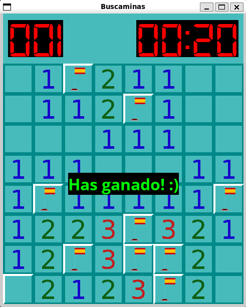

# Minesweeper



Classical minesweeper programmed in Python.

All you need to run this game is ```Python 🐍``` and the graphic library: ***pygame***.

To install the dependece, just run the next sentence on your shell:

``` bash
pip install pygame
```

Then clone this repositoy and run the main file:

**Linux/MacOs:**

``` text
git clone https://github.com/vggm/Minesweeper.git
cd Minesweeper
python3 main.py
```

**Windows:**

``` text
git clone https://github.com/vggm/Minesweeper.git
cd Minesweeper
py main.py
```

I hope you enjoy it! 😊🥰
